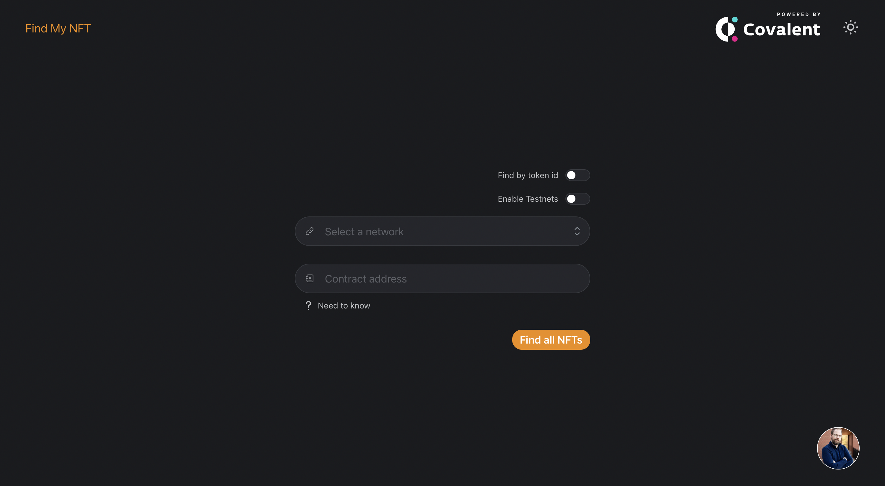
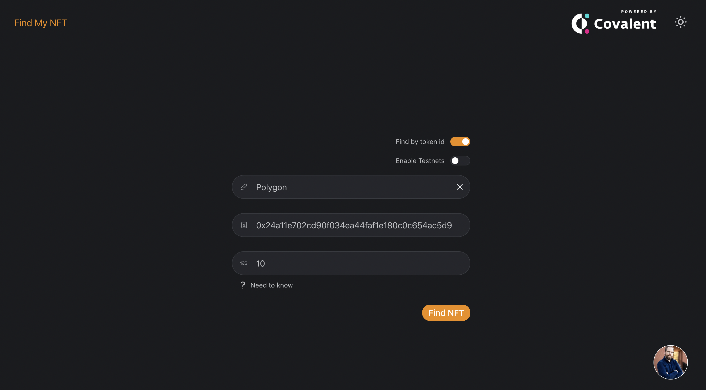
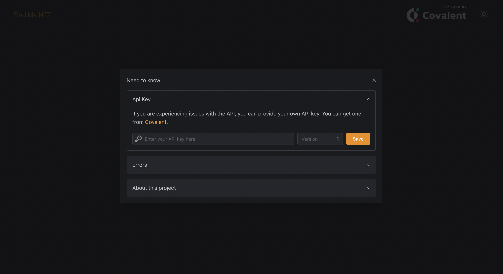

<html>
<body>
<link rel="stylesheet" href="https://cdnjs.cloudflare.com/ajax/libs/font-awesome/6.3.0/css/all.min.css" integrity="sha512-SzlrxWUlpfuzQ+pcUCosxcglQRNAq/DZjVsC0lE40xsADsfeQoEypE+enwcOiGjk/bSuGGKHEyjSoQ1zVisanQ==" crossorigin="anonymous" referrerpolicy="no-referrer" />

# Find My NFT

  

  <table style="width:100%">
    <thead>
      <tr>
        <th>Language</th>
        <th>Built With</th>
        <th>Styled With</th>
        <th>Blockchain Data</th>
      </tr>
    </thead>
    <tbody>
      <tr>
        <td><a href="https://www.typescriptlang.org/">Typescript</a></td>
        <td><a href="https://nextjs.org/">Next.js</a></td>
        <td><a href="https://mantine.dev/">Mantine</a></td>
        <td><a href="https://www.covalenthq.com/">Covalent</a></td>
      </tr>
    </tbody>
  </table>

<h2 style="color:orange">About The Project</h2>

  Created a tool to help you find the your collection or token on the blockchain. You can find your collection by contract address or by token id. You can also find your collection on testnets. It is a work in progress, so please let me know if you have any suggestions or find any bugs.

<h2 style="color:orange">What I learned</h2>

  This was my first time using Mantine for styling and I must say that I really enjoyed it. It's a great library and I will definitely use it again. It made styling a breeze. I am not new the Next.js but this was my first dapp with React v18 and that presented a couple of challenges. The fact that <code>strict-mode</code> is on by default caused some interesting behaviour with the way I was utilizing some of my useEffect hooks. The indexing API from Covalent worked flawlessly. This was a fun project to built and it turned out great.

<h2 style="color:orange">Installation</h2>

  <strong>You will be up and running in 3 simple steps</strong>

<pre>
// Step 1
git clone https://github.com/passandscore/find-my-nft.git

// Step 2
yarn run findmynft

// Step 3
Open your browser and go to http://localhost:3000/
</pre>

<h1 style="color:orange">Features</h1>

<strong>1. Search</strong>

  

<h4>Functionality</h4>

<ul style="margin-bottom:2rem">
  <li>Find a collection by contract address.</li>
  <li>Find a token by contract address &amp; token id.</li>
  <li>Find tokens within test networks.</li>
</ul>

<strong>2. Token Collections</strong>

  

<h4>Functionality</h4>

<ul style="margin-bottom:2rem">
  <li>Built in pagination.</li>
  <li>Fully responsive. Works on mobile devices.</li>
  <li>Displays total token supply for the collection.</li>
</ul>

<strong>3. Token Profiles</strong>

  

<h4>Functionality</h4>

<ul style="margin-bottom:2rem">
  <li>Displays contract details.</li>
  <li>Displays current token owner.</li>
  <li>Displays previous token owner.</li>
  <li>Links to block explorers.</li>
  <li>Displays NFT externally in high resolution.</li>
  <li>Links to the stored metadata on IPFS.</li>
</ul>

<strong>4. Need To Know</strong>

  

<h4>Functionality</h4>

<ul style="margin-bottom:2rem">
  <li>Allows you to provide your own Colavent API key.</li>
  <li>Explains the most common errors that you may experience.</li>
  <li>Talks about me, the developer.</li>
</ul>

<strong>You can find me on social media:</strong>

<a href="https://github.com/passandscore" style="margin-right:1rem; color:orange" target="_blank"></i></a>

<a href="https://discord.gg/jXPnv2t5mN" style="margin-right:1rem; color:orange;" target="_blank";></i></a>

</body>
</html>
